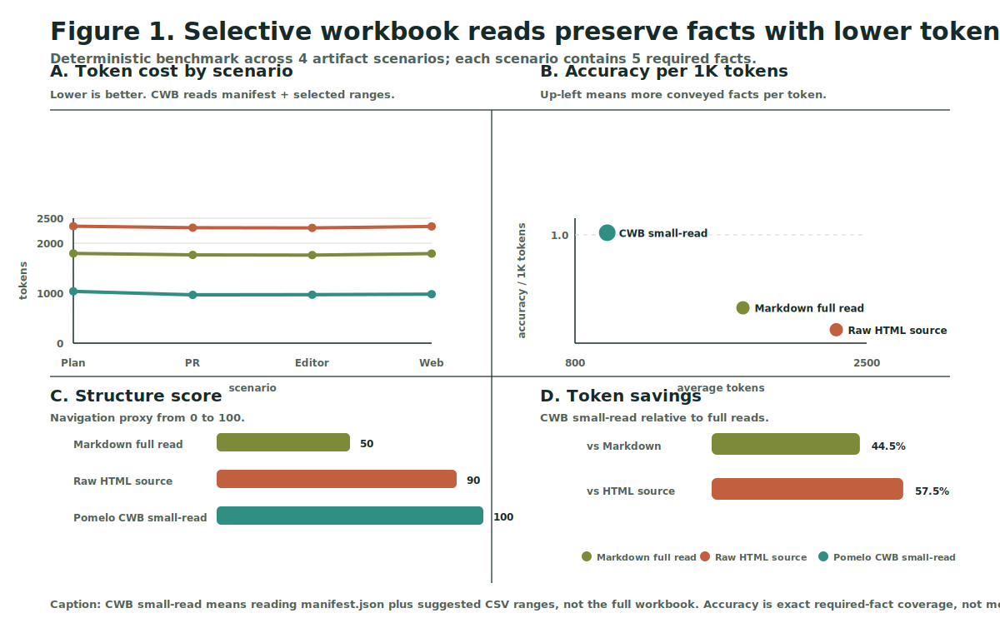
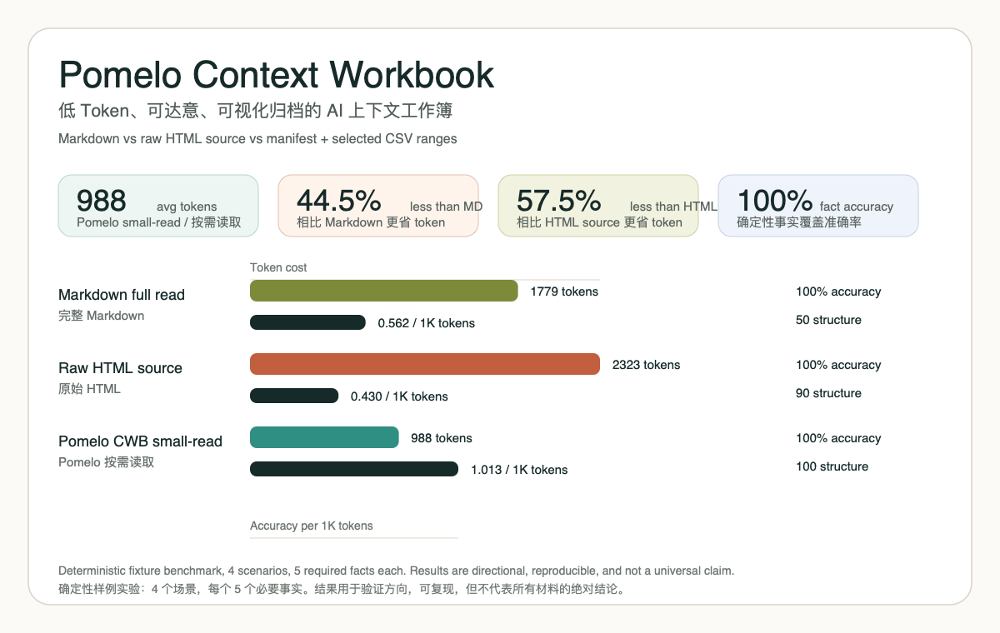
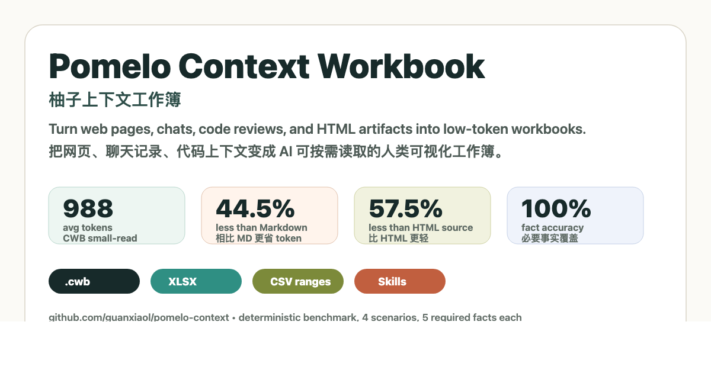

# Pomelo Context Workbook / 柚子上下文工作簿

<p align="center">
  
</p>

[](https://github.com/guanxiaol/pomelo-context/actions/workflows/node.yml)
[](LICENSE)


**Turn web pages, chats, code reviews, and HTML artifacts into low-token workbooks that agents can read by range and humans can archive forever.**

**把网页、聊天记录、代码上下文和 HTML Artifact 变成低 Token、可切片、可归档的 AI 上下文工作簿。**

[Interactive Demo](https://guanxiaol.github.io/pomelo-context/) · [Launch Kit](docs/launch-kit.zh-en.md) · [中文使用手册](docs/usage-manual.zh.md) · [GitHub interactivity note](docs/github-interactivity.zh.md)



<details>
<summary>Classic benchmark card / 传播用实验卡片</summary>



</details>

## Why Star This / 为什么值得 Star

Star this project if you care about **agent context engineering**: not bigger prompts, but better context containers.

如果你关心 AI Agent 的上下文工程，这个项目值得收藏：重点不是写更长的提示词，而是把信息做成可索引、可切片、可迁移的上下文容器。

- **Lower token cost:** deterministic fixtures show `988` avg tokens for CWB small-read vs `1779` for full Markdown and `2323` for raw HTML source.
- **Less information loss:** required facts are preserved through manifest + CSV range reads.
- **Human-friendly archive:** every bundle keeps `workbook.xlsx`, `artifact.html`, notes, CSV sheets, and assets.
- **Agent-friendly protocol:** skills tell Claude Code, Cursor, Codex, and other agents to read the manifest first, then only relevant ranges.
- **Open benchmark:** every chart and report in this repo can be regenerated locally.

## 中文简介

Pomelo Context Workbook（`cwb`）是一个面向 AI Agent 和人的 **低 Token 上下文工作簿协议**。它把网页、聊天记录、Markdown 文档、表格、图片、代码上下文和可交互 HTML artifact 转成一个 `.cwb` bundle，让 AI 先读索引，再按 sheet/range 精准读取信息；人类则可以直接打开 Excel、HTML 或 Markdown 版本长期归档。

它的目标不是替代 HTML 或 Markdown，而是补上二者在 Agent 场景里的缺口：**省 token、少丢信息、可索引、可切片、可迁移、可视化**。第一轮确定性实验显示，在 4 个场景、每个场景 5 个必要事实的样例中，`cwb-small` 以 `988` 平均 token 达到 `100%` 事实覆盖准确率，相比完整 Markdown 少 `44.5%` token，相比原始 HTML source 少 `57.5%` token。

## English Overview

Pomelo Context Workbook (`cwb`) is a **low-token context workbook protocol** for AI agents and humans. It turns long web pages, chat logs, Markdown notes, CSV/XLSX-like tables, images, code folders, and interactive HTML artifacts into a `.cwb` bundle:

- `manifest.json` for agent-first indexing and token budgeting.
- `workbook.xlsx` for human reading and durable sharing.
- `sheets/*.csv` for cheap range reads.
- `notes/*.md` for summaries and prompt recipes.
- `assets/` for optional HTML snapshots and source artifacts.

The point is not to replace HTML or Markdown. HTML is great for rich reading and interaction; Markdown is excellent for linear writing. Pomelo adds indexing, slicing, migration, and agent-friendly selective reads so a model can continue from a large artifact without reading the whole artifact.

## Keywords / 关键词

**English:** AI context engineering, token optimization, agent memory, context workbook, HTML artifacts, Markdown alternative, XLSX archive, Claude Code skill, Cursor rules, web archive, chat migration, code context management.

**中文：** AI 上下文工程、Token 节省、Agent 记忆、上下文工作簿、HTML Artifact、Markdown 替代方案、Excel 归档、Claude Code Skill、Cursor 规则、网页归档、聊天记录迁移、代码上下文管理。

The idea is inspired by Thariq Shihipar's HTML artifact examples. See `ACKNOWLEDGEMENTS.md` for the full source attribution and references.

For a longer bilingual introduction, see `docs/introduction.zh-en.md`.

## 60-Second Demo

```bash
git clone https://github.com/guanxiaol/pomelo-context.git
cd pomelo-context
npm test
npm run cwb -- pack examples/web-archive.md --recipe web-or-chat-archive --out tmp/demo.cwb
npm run cwb -- inspect tmp/demo.cwb --index --budget small
npm run cwb -- read tmp/demo.cwb --sheet Sections --range A1:E8
```

What you get:

- A `.cwb` bundle with `manifest.json`, `workbook.xlsx`, CSV sheets, notes, and assets.
- A low-token index that tells agents what to read next.
- A human-readable workbook for long-term sharing and review.

## Quick Start

```bash
npm run cwb -- pack examples/web-archive.md --recipe web-or-chat-archive --out tmp/demo.cwb
npm run cwb -- inspect tmp/demo.cwb --index --budget small
npm run cwb -- read tmp/demo.cwb --sheet Sections --range A1:E8
npm run cwb -- validate tmp/demo.cwb
npm run cwb -- benchmark tmp/demo.cwb
npm run cwb -- convert tmp/demo.cwb --to html --out tmp/demo.html
npm run experiment
```

This repository intentionally has no runtime dependencies. Node 22.18+ can run the TypeScript entrypoint directly.

Tiny inputs may benchmark worse than raw text because the bundle has a fixed index cost. The protocol is designed for long pages, chats, PRs, and code contexts:

```bash
npm run cwb -- benchmark . --recipe module-map
```

That command estimates reading this repository directly versus reading a workbook index and selected ranges.

## Is This Prompt Engineering?

It uses prompts, but it is not only prompt engineering.

Pomelo is a **file protocol + CLI + skill workflow**:

| Layer | Role |
| --- | --- |
| `.cwb` protocol | Stores context as manifest, workbook, CSV ranges, notes, and assets. |
| CLI | Packs, inspects, reads, validates, converts, and benchmarks bundles. |
| Skills / rules | Teach agents to read selectively instead of loading everything. |
| Prompt templates | Help agents choose the right sheet/range for a task. |

中文理解：提示词只是调用方式之一，真正核心是 `.cwb` 文件协议和“先索引、后按需读取”的 Skill 工作流。

## Use Cases

| Use case | What Pomelo preserves | Why it helps agents |
| --- | --- | --- |
| Web / X archive | text, images, tables, code, links, source URL | Avoids rereading noisy web pages. |
| AI chat migration | decisions, tasks, summaries, original snippets | Lets a new agent resume a long thread. |
| Code context | modules, key files, risks, call paths | Keeps coding context cheap and navigable. |
| PR review | severity, annotated diff, affected files, test gaps | Turns review evidence into reusable context. |
| Design systems | tokens, components, variants, states | Makes visual/design context queryable. |
| Research reports | claims, sources, metrics, open questions | Separates durable facts from prose. |

## Share Kit

Want to introduce Pomelo to others? Use the bilingual launch copy in `docs/launch-kit.zh-en.md`.



## Interactive Components on GitHub

README files are best for static assets: SVG, PNG, badges, tables, Mermaid, and collapsible details. Real JavaScript interaction belongs on GitHub Pages.

Pomelo includes a GitHub Pages demo in `site/index.html`:

[https://guanxiaol.github.io/pomelo-context/](https://guanxiaol.github.io/pomelo-context/)

See `docs/github-interactivity.zh.md` for the README vs Pages split.

## Contributing

Pomelo needs real-world fixtures more than abstract ideas. The most valuable contributions are long webpages, chat exports, PR reviews, code contexts, and design/research artifacts that can become reproducible benchmarks.

- Contribution guide: `CONTRIBUTING.md`
- Use-case issues: `.github/ISSUE_TEMPLATE/use_case.yml`
- Benchmark fixtures: `.github/ISSUE_TEMPLATE/benchmark_fixture.yml`
- Maintainer growth notes: `docs/growth-playbook.zh.md`

## Built-In Recipes

- `compare-options`
- `implementation-plan`
- `annotated-pr-review`
- `module-map`
- `design-system-reference`
- `prototype-snapshot`
- `research-explainer`
- `status-report`
- `incident-report`
- `custom-editor-export`
- `web-or-chat-archive`

## Why This Saves Tokens

The `.xlsx` file is not magic compression. The savings come from the protocol:

1. Agents read `manifest.json` first.
2. They inspect sheet names, row counts, summaries, and suggested ranges.
3. They pull only the relevant CSV ranges.
4. They use `workbook.xlsx` or `artifact.html` for human review, not as the default model input.

## Skill

See `skills/context-workbook/SKILL.md` for a cross-agent reading workflow. The skill tells agents to inspect the manifest first, then read only sheet ranges that match the task.

## Web Compatibility

Context Workbook extracts webpage text, photos/images, tables, code blocks, and links into separate sheets. See `docs/compatibility.md`.

## Benchmark Matrix

The file `examples/html-effectiveness-catalog.json` maps the 20 HTML Effectiveness demos to Context Workbook recipes and expected sheets. See `docs/html-effectiveness-mapping.md`.

## Markdown vs HTML vs CWB Experiment

Run:

```bash
npm run experiment
```

Current deterministic fixture results:

| Method | Avg Tokens | Fact Accuracy | Structure Score | Accuracy per 1K Tokens |
| --- | ---: | ---: | ---: | ---: |
| Markdown full read | 1779 | 100.0% | 50.0 | 0.562 |
| HTML source read | 2323 | 100.0% | 90.0 | 0.430 |
| CWB small read | 988 | 100.0% | 100.0 | 1.013 |

Outputs are written to `experiments/results/`, including `experiment-report.html`, `experiment-report.md`, `experiment-summary.csv`, and `experiment-results.json`.

See `docs/experiment-methodology.zh.md` for the metric definitions and limitations.

## Article Draft

See `docs/context-workbook.zh.md` for a Chinese article draft introducing the idea.

## Usage Manual

See `docs/usage-manual.zh.md` for Claude Code and Cursor deployment instructions.

## Roadmap

See `docs/roadmap.md`.

## Acknowledgements

This project is inspired by Thariq Shihipar's [Using Claude Code: The Unreasonable Effectiveness of HTML](https://x.com/trq212/status/2052809885763747935), its [companion examples page](https://thariqs.github.io/html-effectiveness/), and the [html-effectiveness repository](https://github.com/ThariqS/html-effectiveness). Context Workbook is independent and not affiliated with those projects or organizations.
